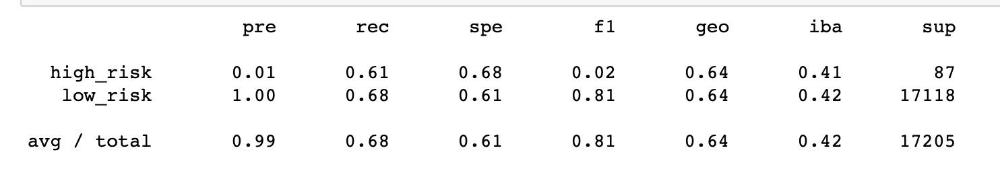
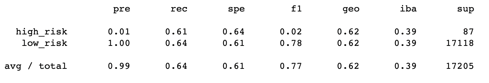
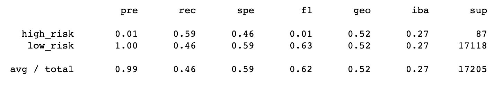
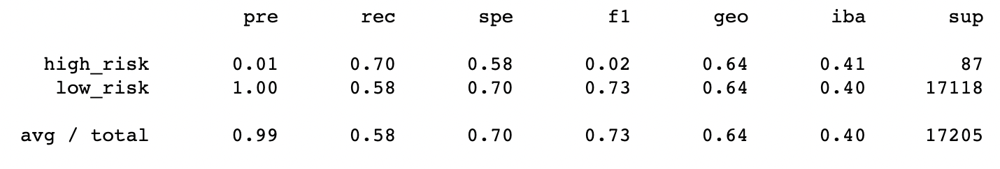
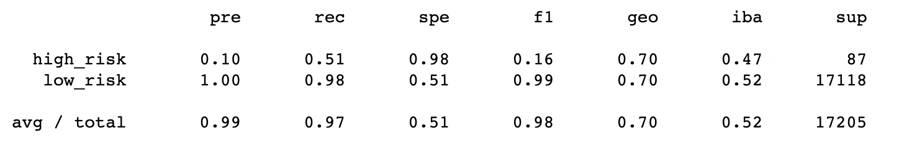
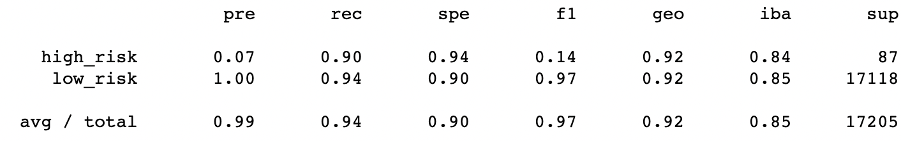

# Machine Learning Challenge
### Overview of the analysis
The purpose of this analysis was to use different models to see if it was possible to predict credit loan risk based on a collection of features. 

### Results
#### Balanced accuracy scores, Precision, and Recall scores of all six machine learning models

1. Naive Random Oversampling using RandomOversampler

2. SMOTE Oversampling using SMOTE

3. Undersampling using ClusterCentroids

4. Combination (Over and Under) Sampling using SMOTEEN

5. Ensemble Learners using BalancedRandomForestClassifier

6. Ensemble Learners using Easy Ensemble AdaBoost Classifier

### Summary
I can't recommend any of the models particularly due to their low precision scores for predicting high_risk loans. Yes, precision is high for low_risk, but that could be a fluke. Unless both precision scores are high, then the models are a bit useless to us. We could however look more into features of interest, like bc_open_to_buy, inq_last_12m, inq_fi, and so on.

